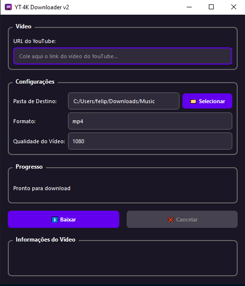

<p align="center">
  
</p>

<h1 align="center">YT 4K Downloader v2</h1>


<p align="center">
  
  
</p>

## 📝  Estrutura de Pastas 
```
yt-downloader-4k/
├── src/
│   ├── main.py                     # Ponto de entrada da aplicação
│   │
│   ├── gui/                        # Interface gráfica
│   │   ├── main_window.py          # Janela principal
│   │   └── components/             # Componentes da GUI
│   │       └── download_thread.py  # Thread de download
│   │
│   ├── core/                       # Lógica principal
│   │   └── downloader.py           # Motor de download
│   │
│   │
│   ├── config/                     # Configurações
│   │   └── settings.py             # Gerenciamento de configurações
│   │
│   └── assets/                     # Recursos estáticos
│       └── 4kicon.ico              # Ícone da aplicação
│
├── data/                           # Dados da aplicação
│   └── config.json                 # Configurações salvas
│
├── requirements.txt                # Dependências
├── README.md                       # Documentação
└── 
```



## 🔧 Implementações

###  **Arquitetura Modular**
- **Separação de responsabilidades**: Cada módulo tem uma função específica
- **Baixo acoplamento**: Módulos independentes e reutilizáveis
- **Alta coesão**: Funcionalidades relacionadas agrupadas

### **Interface**
- **Organização visual**: Agrupamento lógico de elementos
- **Responsividade**: Interface adaptável a diferentes tamanhos
- **Feedback visual**: Indicadores de progresso e status

### **Funcionalidades**
- **Validação de URL**: Verifica se a URL é válida antes do download
- **Informações do vídeo**: Exibe dados como título, canal e duração
- **Cancelamento de download**: Possibilidade de interromper downloads
- **Pasta padrão inteligente**: Auto-seleciona pasta Downloads do sistema
- **Tratamento de erros robusto**: Captura e exibe erros de forma amigável

### **Implementações Técnicas**
- **Threading aprimorado**: Download não bloqueia a interface
- **Gestão de memória**: Melhor uso de recursos do sistema
- **Configurações persistentes**: Salva todas as preferências do usuário
- **Sanitização de nomes**: Remove caracteres inválidos dos arquivos
- **Logs estruturados**: Sistema de logging para debugging

### **Experiência do Usuário UX**
- **Interface intuitiva**: Layout claro e funcional
- **Feedback em tempo real**: Progresso detalhado com velocidade e tamanho
- **Configurações lembradas**: Mantém últimas configurações usadas
- **Mensagens informativas**: Avisos e confirmações claras

## Como utilizar

### Instalação
```bash
# Clone o projeto
git clone <repo-url>
cd yt-4k-downloader

# Instale as dependências
pip install -r requirements.txt

# Execute a aplicação
python src/main.py
```

### 👷 Adicionando Novas Funcionalidades

#### Para adicionar um novo serviço:
1. Crie arquivo em `src/services/`
2. Implemente a lógica do serviço
3. Importe onde necessário

#### Para modificar a interface:
1. Edite `src/gui/main_window.py`
2. Adicione componentes em `src/gui/components/`
3. Mantenha estilos em `config/settings.py`

#### Para alterar configurações:
1. Modifique `src/config/settings.py`
2. Atualize `APP_CONFIG` para novas opções
3. Adicione validações no `ConfigManager`


